# Data Science Task Report  
### **Kovai.co – Data Scientist Intern Task Round**  
### **Candidate:** Dhanushkumar M (22Z317)  
### **College:** PSG College of Technology  
### **Dataset:** Daily_Public_Transport_Passenger_Journeys_by_Service_Type.csv 

### **Colab Link:** [Dhanushkumar M](https://colab.research.google.com/drive/14sxSTUJmwaRPhz6ykhFMKIeMS28a7f0z?usp=sharing)

---

# 1. Introduction  
This report summarizes the complete workflow for forecasting daily public transport passenger journeys across different service types as part of the **Kovai.co Data Scientist Intern Task Round**.  
The objective is to **analyze**, **understand**, and **forecast** ridership for the next 7 days using a robust statistical time-series model.

---

# 2. Dataset Description  
**Dataset Name:** *Daily_Public_Transport_Passenger_Journeys_by_Service_Type*  
**Total Rows:** 1918  
**Features:** 7 service-based passenger count columns  

### **Columns**
- **Date:** Daily timestamp  
- **Local Route:** Standard bus ridership  
- **Light Rail:** Light rail commuter counts  
- **Peak Service:** Morning/evening ride counts  
- **Rapid Route:** Express service passengers  
- **School:** School transport users  
- **Other:** Additional categorized ridership  

### **Data Understanding Steps**
1. Loaded dataset and inspected structure (`df.info()`)  
2. Checked missing values (`df.isna().sum()`)  
3. Converted Date column → datetime  
4. Sorted chronologically  
5. Filled 20 missing values in *Other* using forward-fill  
6. Created **Total** = sum of all 6 service columns  

---

# 3. Exploratory Data Analysis (EDA)

### **3.1 Trend Analysis**
- Multi-year ridership trend visualized for each service  
- Rapid Route shows long-term upward movement  
- Light Rail remains consistent (commuter stable pattern)

### **3.2 Distribution Analysis**
- Local Route & Rapid Route show high variance  
- School service highly skewed due to holidays/weekends

### **3.3 Weekly Seasonality**
Strong weekly rhythm:
- Weekday ridership spike  
- Weekend drops across all services  

### **3.4 Correlation Heatmap**
- Moderate correlation between Local Route, Rapid Route, and Peak Service  
- Light Rail behaves independently (stable commuter base)

---

# 4. Seasonal & Time-Series Diagnostics  
To verify seasonality and model suitability:

### ACF & PACF analysis  
Shows strong lag-7 autocorrelation → weekly pattern.

### Seasonal Decomposition  
Trend + seasonal + residual breakdown confirms clean **7-day seasonality**.

Therefore, **SARIMA with weekly seasonal period (7)** was chosen.

---

# 5. SARIMA Model – Training & Forecasting

### **Model Used:**  
**SARIMA(p=1, d=1, q=1) × (P=1, D=1, Q=1, s=7)**

### **Steps Followed**
1. Train-Test split using last 7 days for each service  
2. Fit SARIMA models on training data  
3. Validate using MAE and RMSE  
4. Fit full model again on complete dataset  
5. Forecast next 7 days with 95% CI  
6. Export predictions to CSV  

### **Evaluation Metrics (MAE & RMSE)**  
*(Extracted from results/sarima_evaluation_metrics.csv)*  

Local Route → MAE: 8975.91 | RMSE: 10609.43  
Light Rail → MAE: 5266.32 | RMSE: 5955.39  
Peak Service → MAE: 210.31 | RMSE: 248.89  
Rapid Route → MAE: 9591.28 | RMSE: 11418.75  
School → MAE: 2542.60 | RMSE: 3080.68  

---

# 6. Final Results – Forecast
The 7-day forecasts for all service types were saved in:

`results/7_day_forecasts_by_service.csv`  

Forecasting plots saved in:

 `plots/`  

---

# 7. Key Insights  
(From “key_insights.md” :contentReference[oaicite:1]{index=1})

1. **Weekly cycles dominate ridership** – strong weekday peaks  
2. **Rapid Route shows fastest growth**  
3. **Light Rail highly stable – commuter-centric**  
4. **School service is extremely event-driven**  
5. **Total ridership aligns perfectly with 7-day seasonality**  

---

# 8. Conclusion  
The SARIMA model successfully captured the dataset’s strong weekly seasonality and produced reliable 7-day forecasts for all transport services.  
Insights derived from the analysis can guide **scheduling**, **capacity planning**, and **operational optimization** for public transport systems.

---

# 9. Files Delivered
- Notebook: *kovaico_dhanushkumar.ipynb*  
- Forecasts: *results/7_day_forecasts_by_service.csv*  
- Metrics: *results/sarima_evaluation_metrics.csv*  
- Plots: */plots/*  
- Insights: *key_insights.md*  
- Technical Report: *REPORT.md* (this file)

---

## Exploratory Data Analysis (EDA) — Visual Overview

Below is a structured gallery of all EDA visualizations used in the project.  
Each image is clickable and opens in full resolution.

---

## EDA Visualization Gallery

| **Visualization** | **Preview** |
|-------------------|-------------|
| **1. Distribution Overview** (Passenger distributions across services) |  |
| **2. Daily Trend for Each Service Type** | <a href="plots/eda_images/eda_daily_each_type.png">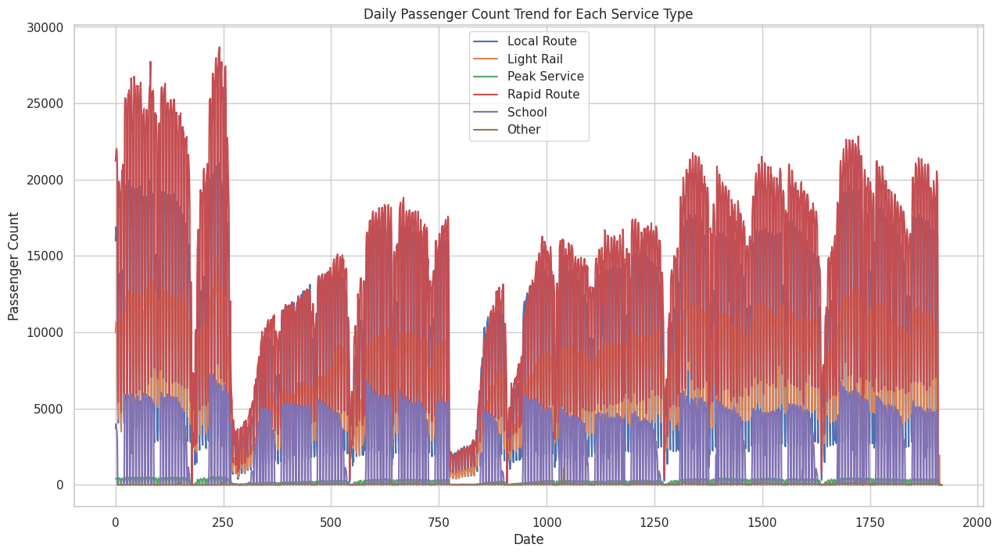</a> |
| **3. Overall Daily Passenger Trend (Total Ridership)** | <a href="plots/eda_images/eda_daily_passenger.png">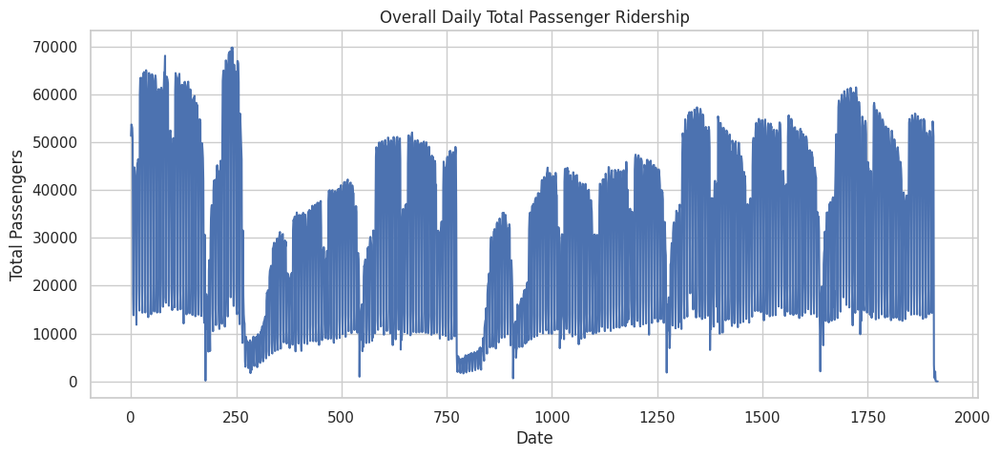</a> |
| **4. Correlation Heatmap** | <a href="plots/eda_images/eda_heatmap.png">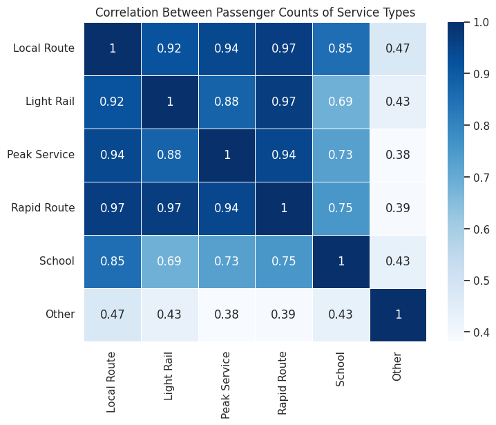</a> |
| **5. Weekly Ridership Pattern** | <a href="plots/eda_images/eda_weekly_ridership.png">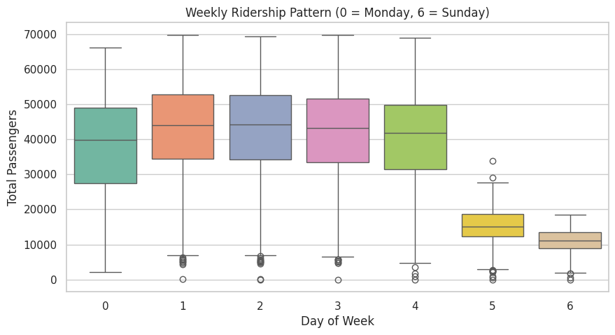</a> |
| **6. Seasonal Decomposition** | <a href="plots/eda_images/eda_seasonal_decomposition.png">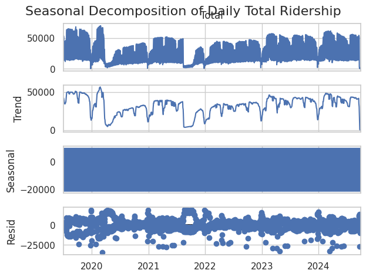</a> |
| **7. ACF Plot (Autocorrelation)** | <a href="plots/eda_images/eda_acf.png">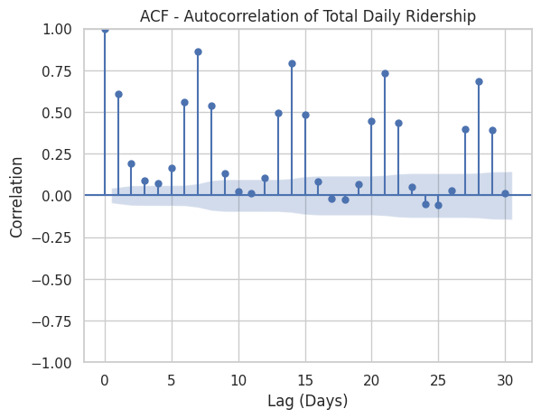</a> |
| **8. PACF Plot (Partial Autocorrelation)** | <a href="plots/eda_images/eda_pcf.png">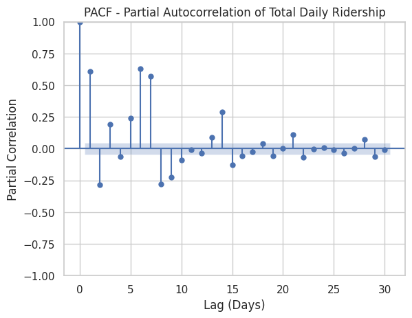</a> |

---

## Forecasting Visualizations

The following plots show **last 60 days + 7-day SARIMA forecast + 95% CI** for each service.

| **Service** | **Forecast Plot** |
|-------------|-------------------|
| **Local Route** | <a href="plots/forecast_Local_Route.png">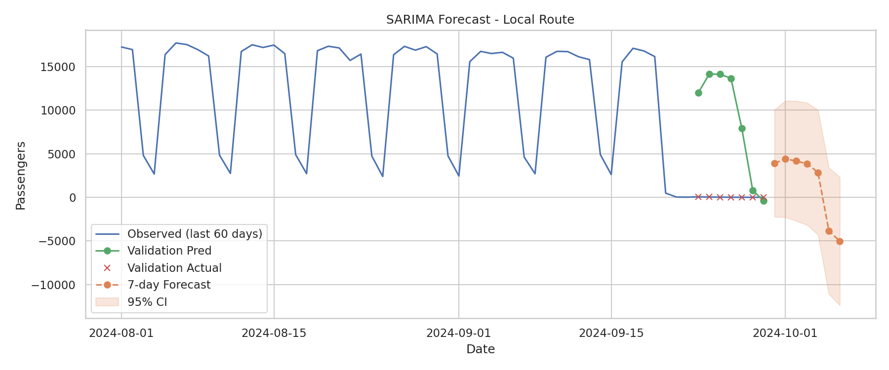</a> |
| **Light Rail** | <a href="plots/forecast_Light_Rail.png">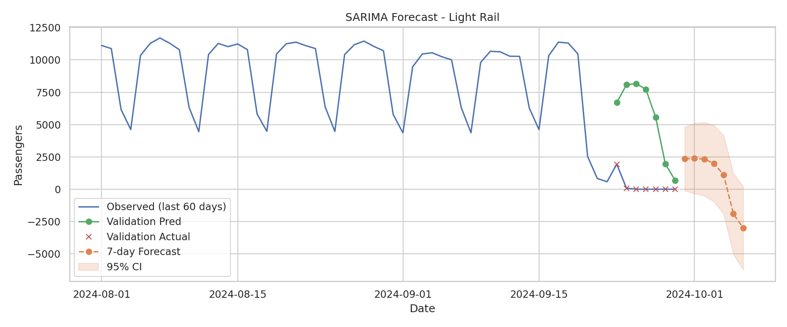</a> |
| **Peak Service** | <a href="plots/forecast_Peak_Service.png">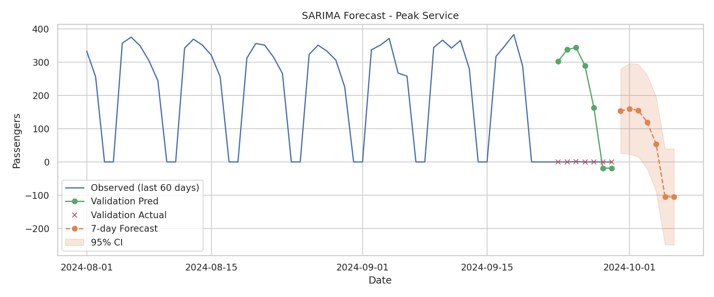</a> |
| **Rapid Route** | <a href="plots/forecast_Rapid_Route.png">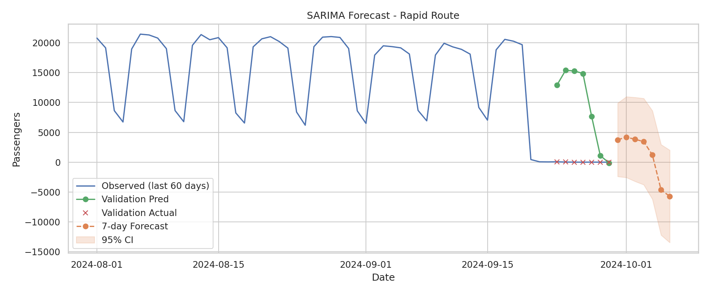</a> |
| **School Service** | <a href="plots/forecast_School.png">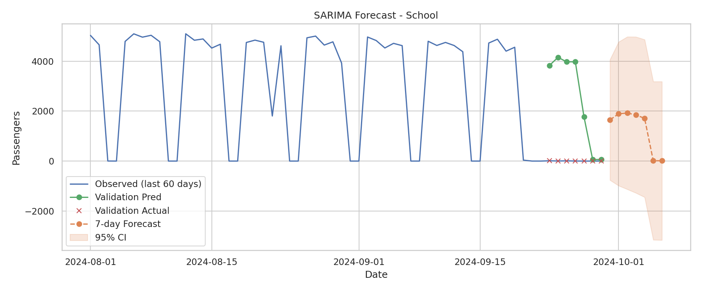</a> |

---

## Key Forecast Outputs

###  Forecast Table  
[7-Day Forecast CSV](results/7_day_forecasts_by_service.csv)

###  Model Performance  
[Evaluation Metrics (MAE & RMSE)](results/sarima_evaluation_metrics.csv)

---

- All visualizations were generated during the SARIMA-based time-series forecasting pipeline.  
- These images help validate stationarity, seasonality, and forecast reliability.  
- The structured grid layout provides a clean portfolio-level presentation.

---

